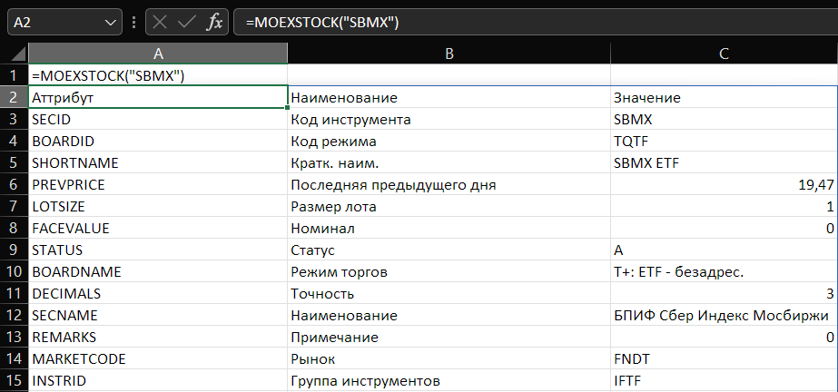
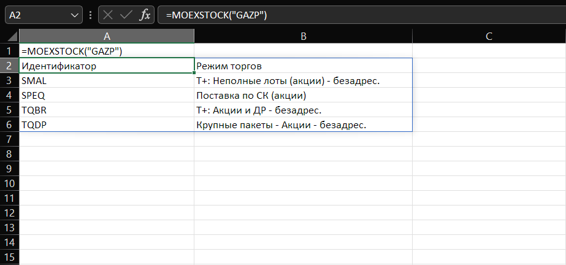
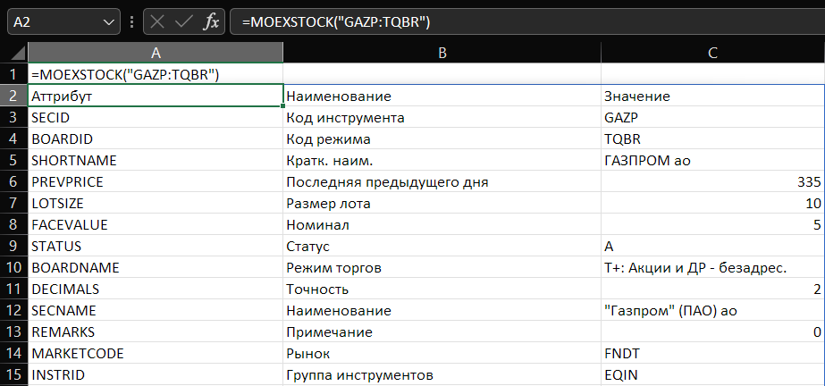
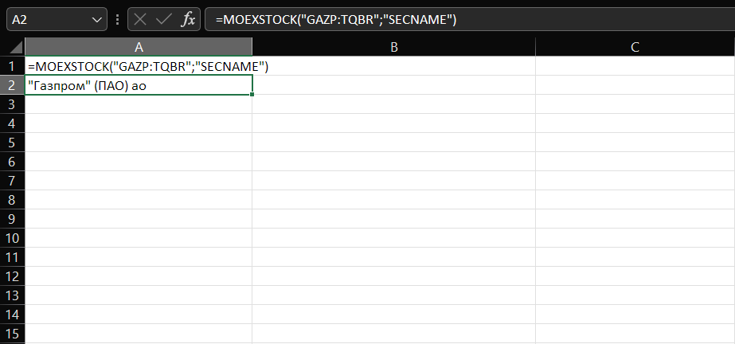

## MoexXL
MoexXL - это плагин Excel для получения биржевых данных от информационно-статистического сервера Московской биржи (https://www.moex.com/) путем реализации бесплатного варианта публичного API

Поддерживается получение данных Акций, облигаций и фондов ETF
____
### Принцип  действия
Обращение к серверу биржи реализовано через формулы
```excel
=MOEXSTOCK("тикер", "аттрибут")
=MOEXBOND("тикер", "аттрибут")
```
Выдача осуществляется или массивом данных с заголовком, или в ячейке если указан отдельный аттрибут ценной бумаги
___
### Скриншоты
#### Выдача данных по тикеру если бумага торгуется в одном режиме торгов

#### Выдача списка режима торгов по тикеру, если режимов несколько

#### Выдача данных по тикеру в конкретном режиме торгов, при запросе вида тикер:идентификатор_режима

#### Выдача значения отдельного аттрибута


Работа формулы ```MOEXBOND``` аналогична
___

- Плагин использует исключительно данные информационного сервера Московской биржи
- Данные не изменяются и не модифицируются. Данные передаются с задержкой согласно условиям работы бесплатного открытого API
- Запросы кэшируются локально и выдаются с интервалом от 10 минут с целью ускорения работы, снижения объема сетевого трафика и уменьшения нагрузки на пользовательское оборудование.
